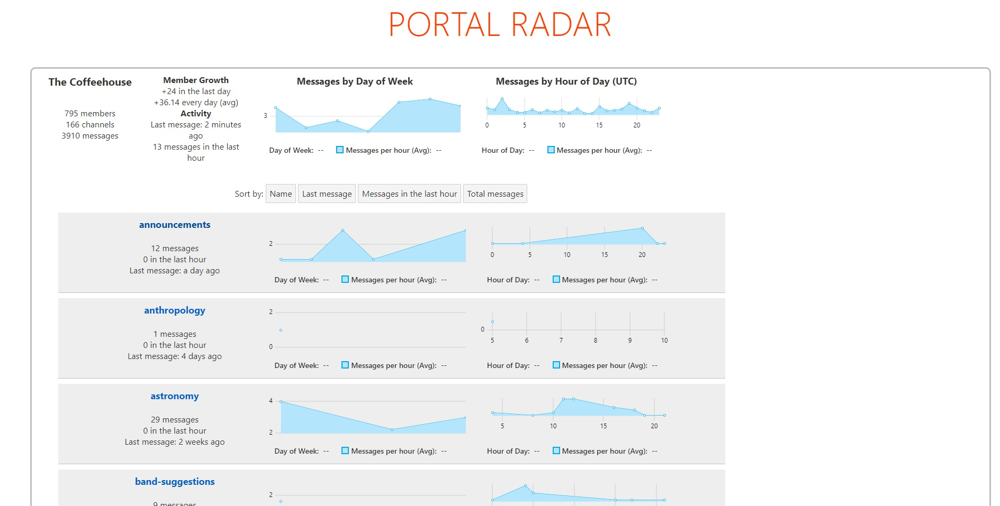

(This is an old project, it's out-of-date, and will probably never be resumed)

# Portal Radar Project

Courtesy of the Coffeehouse.

* Server - written in Django + PostgreSQL
* Client - written in Svelte

Look inside `server/` and `client/` for more information.

